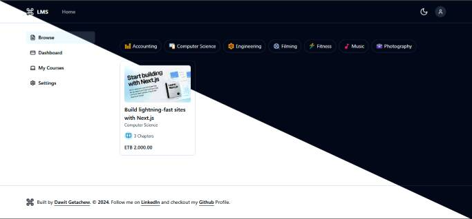

# Learning Management System (LMS)

A modern, full-featured Learning Management System built with Next.js 14, featuring course management, secure payments, and SMS verification.

## Preview



## Demo

🔗 **[Live Demo](https://dave-lms.vercel.app)**

Experience the full features:
- Browse available courses
- Test the authentication system
- Explore the course creation interface
- Try the Chapa payment integration

## Features

- 🔐 Secure Authentication with Phone Number & SMS Verification
- 💳 Course Purchase with Chapa Payment Integration
- 📱 Responsive Design for Mobile and Desktop
- 🎥 Video Content Hosting with Mux
- 📁 File Upload Support with UploadThing
- 🔍 Course Search and Filtering
- 👨‍🏫 Teacher Dashboard for Course Management
- 📊 Student Progress Tracking

## Tech Stack

- **Framework:** Next.js 14 with App Router
- **Database:** MySQL with Prisma ORM
- **Authentication:** NextAuth.js
- **Payment:** Chapa Payment Gateway
- **SMS:** Afromessage API
- **Testing:** Playwright
- **Styling:** Tailwind CSS
- **Video:** Mux
- **File Upload:** UploadThing

## Getting Started

1. Clone the repository
2. Install dependencies:
   ```bash
   npm install
   ```
3. Set up environment variables:
   ```bash
   cp .env.example .env
   ```
4. Set up the database:
   ```bash
   npx prisma generate
   npx prisma db push
   ```
5. Run the development server:
   ```bash
   npm run dev
   ```

## Environment Variables

Required environment variables:
- `DATABASE_URL`: MySQL database URL
- `NEXT_PUBLIC_APP_URL`: Application URL
- `NEXT_PUBLIC_CHAPA_SECRET_KEY`: Chapa payment secret key
- `AFRO_SMS_API_KEY`: Afromessage API key
- `AFRO_SMS_IDENTIFIER_ID`: Afromessage identifier
- `MUX_TOKEN_ID` & `MUX_TOKEN_SECRET`: Mux video hosting credentials
- `UPLOADTHING_SECRET` & `UPLOADTHING_APP_ID`: UploadThing credentials
- `AUTH_SECRET`: NextAuth.js secret

## Testing

Run end-to-end tests:
```bash
npm run test:e2e
```

Run tests with UI:
```bash
npm run test:e2e:ui
```

Run tests in debug mode:
```bash
npm run test:e2e:debug
```

## License

[MIT](https://choosealicense.com/licenses/mit/)

